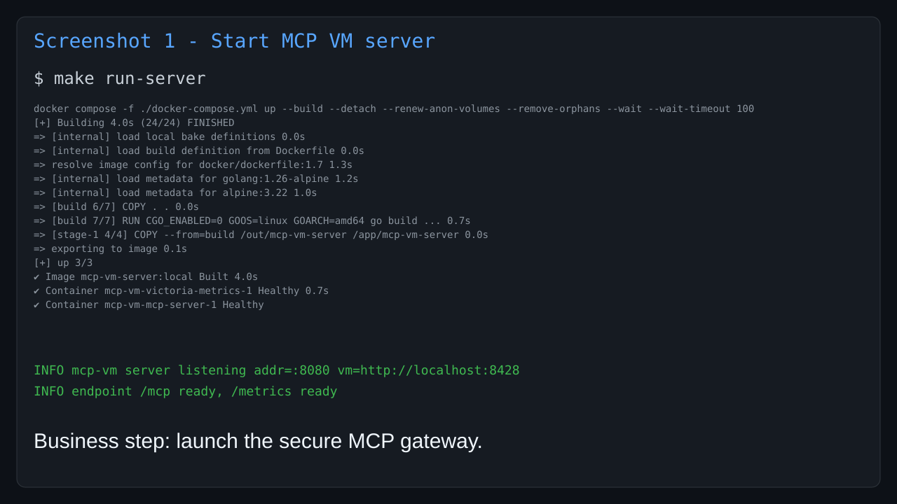
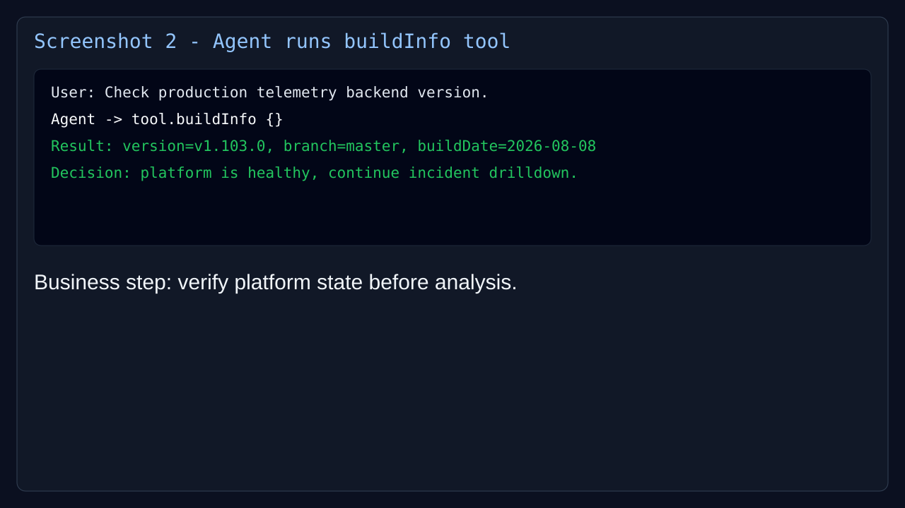
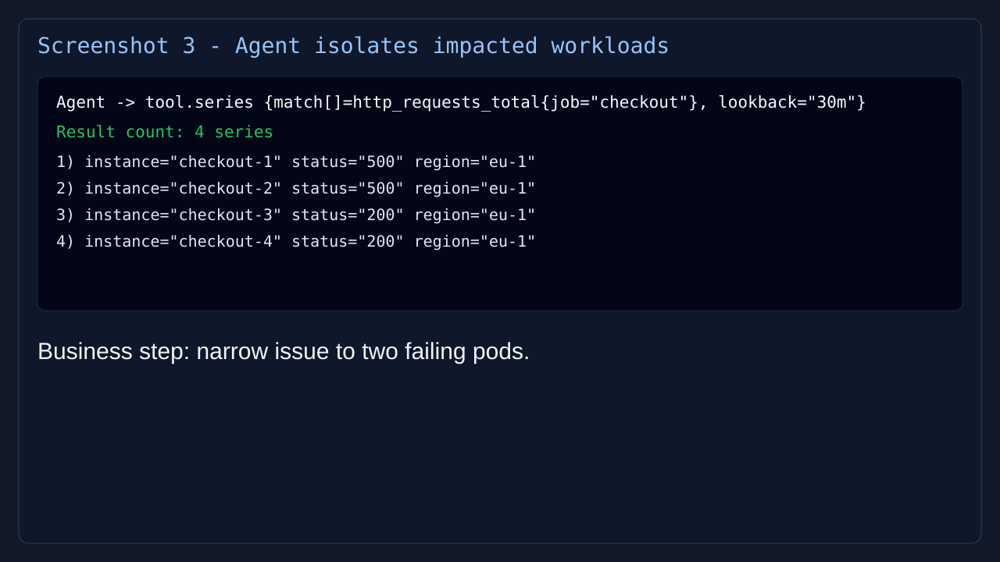
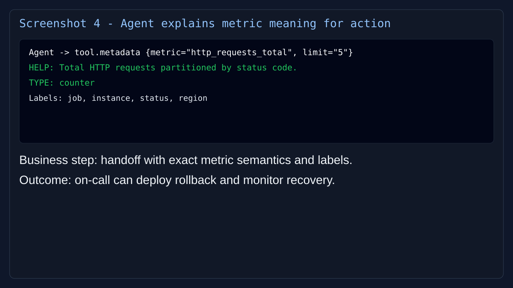

# MCP VictoriaMetrics Server

`mcp-vm` is a Go MCP-over-HTTP server that exposes a limited set of VictoriaMetrics/Prometheus API operations as MCP tools.

## Deliverables checklist

- [x] MCP server source code in this repository
- [x] Technical documentation for local run, data sources, and environment variables
- [x] Architecture diagram in `docs/architecture.md`
- [x] Prompt book (system prompts and guardrails) in `docs/prompt-book.md`

## What is in this repository

- MCP server: `cmd/server/main.go`
- Example MCP client: `cmd/client/main.go`
- MCP tool registration and handlers: `server/mcp/`
- HTTP auth middleware: `server/auth/auth.go`
- Prometheus metrics middleware and collectors: `server/metrics/`

## Data sources

The server uses VictoriaMetrics as its primary source via Prometheus-compatible API methods:

- `buildInfo` -> `Buildinfo()`
- `series` -> `Series()`
- `metadata` -> `Metadata()`

VictoriaMetrics address is configured by `VM_ADDRESS` (default `http://localhost:8428`).

## Server Environment configuration

- `VM_ADDRESS`: VictoriaMetrics base URL (default `http://localhost:8428`)
- `MCP_HTTP_ADDR`: MCP server listen address (default `:8080`)
- `MCP_API_KEY`: API key required in `X-API-Key` header (default `local-dev-mcp-key`)

## Client Environment configuration

- `MCP_SERVER_URL`: client-side MCP endpoint URL (default `http://localhost:8080/mcp`)

## Local run

### 1) Run server locally

```bash
make build-server
./bin/server
```

### 2) Run client locally

```bash
make build-client
./bin/client
```

### 3) Run server with Docker Compose

```bash
docker compose up --build mcp-server
```
It runs MCP server in a container and connects to VictoriaMetrics at `http://host.docker.internal:8428` by default. Override it with:

```bash
VM_ADDRESS=http://localhost:8428 docker compose up --build mcp-server
```

## HTTP endpoints

- MCP endpoint: `http://localhost:8080/mcp`
- Metrics endpoint: `http://localhost:8080/metrics`

All MCP calls must include `X-API-Key` with a value matching `MCP_API_KEY`.

## Practical business scenario (screenshots)

This flow shows how an on-call engineer uses the agent to investigate checkout errors with VictoriaMetrics data behind MCP tools.

### 1) Start MCP gateway

The service starts with API key protection and exposes `/mcp` for agent calls.



### 2) Verify telemetry backend state

The agent calls `buildInfo` first to validate that the metrics backend is reachable and healthy.



### 3) Isolate impacted workloads

The agent calls `series` for checkout request metrics and identifies only failing instances.



### 4) Explain metrics for remediation handoff

The agent calls `metadata` to confirm metric type and labels, then provides actionable context for rollback and monitoring.



## Additional project docs

- Architecture schema: `docs/architecture.md`
- Prompt book: `docs/prompt-book.md`
