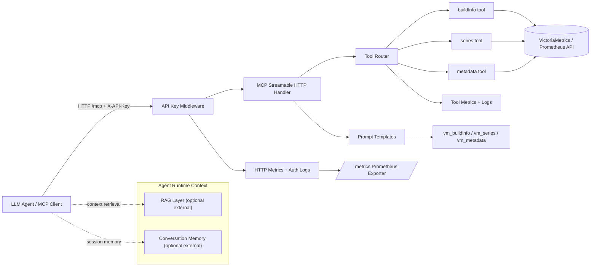

# MCP Server Architecture

## Interaction model

- MCP server is a tool gateway: it does not implement vector storage or memory persistence internally.
- RAG and memory layers are external to this service and are expected to be managed by the MCP client or orchestrating agent runtime.
- The server enforces API-key authentication, then executes only registered tools against VictoriaMetrics.
- Prometheus-compatible runtime metrics are exposed on `/metrics`.

